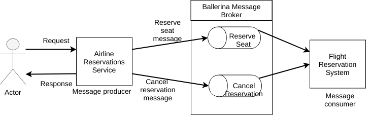

# Ballerina Message Broker  
[Ballerina Message Broker](https://github.com/ballerina-platform/ballerina-message-broker) is a lightweight, easy-to-use, 100% open source message-brokering server.
It uses AMQP 0-9-1 as the messaging protocol.

> In this guide you will learn about building a RESTful Web Service which uses Ballerina message broker as the message broker. 

The following are the sections available in this guide.

- [What you'll build](#what-youll-build)
- [Prerequisites](#prerequisites)
- [Developing the service](#developing-the-service)
- [Testing](#testing)
- [Deployment](#deployment)
- [Observability](#observability)

## What you’ll build 

To understanding how you can use messaging with Ballerina message broker, let’s consider a real world use case of an Airline reservation online application. You can simmulate the Airline Reservations sample to simulate the following tasks:

- Reserving seats on a flight
- Cancelling a reservation

For each task, you put a message on a particular Ballerina message queue. The appropriate message flow gets the message from the queue and processes the message.

The following figure illustrates the scenario of the airline reservation service with Ballerina messaging. 

&nbsp;
&nbsp;

&nbsp;
&nbsp;

- **Reserve Seat** : To reserve a seat you can use the HTTP POST message that contains the passanger details, which is sent to the URL `http://localhost:9090/airline/reservation`. 
- **Cancel reservation** : You can cancel the existing booking by sending an HTTP POST request to the URL `http://localhost:9090/airline/cancellation`. 

## Prerequisites
 
- JDK 1.8 or later
- [Ballerina Distribution](https://github.com/ballerina-lang/ballerina/blob/master/docs/quick-tour.md)
- [Ballerina Message Broker](https://github.com/ballerina-platform/ballerina-message-broker)
- A Text Editor or an IDE 

### Optional requirements
- Ballerina IDE plugins ([IntelliJ IDEA](https://plugins.jetbrains.com/plugin/9520-ballerina), [VSCode](https://marketplace.visualstudio.com/items?itemName=WSO2.Ballerina), [Atom](https://atom.io/packages/language-ballerina))
- [Docker](https://docs.docker.com/engine/installation/)

## Developing the service 

> If you want to skip the basics, you can download the git repo and directly move to "Testing" section by skipping "Developing" section.

### Create the project structure

Ballerina is a complete programming language that can have any custom project structure that you wish. Although the language allows you to have any package structure, use the following package structure for this project to follow this guide.

```
messaging-with-ballerina
├── Ballerina.toml
├── guide.flight_booking_service
│   └── airline_resrvation.bal
└── guide.flight_booking_system
    └── flight_booking_system.bal

```
You can create the above Ballerina project using Ballerina project initializing toolkit.

- First, create a new directory in your local machine as `restful-service` and navigate to the directory using terminal. 
- Then enter the following inputs to the Ballerina project initializing toolkit.
```bash
restful-service$ ballerina init -i
Create Ballerina.toml [yes/y, no/n]: (y) y
Organization name: (username) messaging-with-ballerina
Version: (0.0.1) 
Ballerina source [service/s, main/m]: (s) s
Package for the service : (no package) guide.flight_booking_service
Ballerina source [service/s, main/m]: (s) s
Package for the service : (no package) guide.flight_booking_system
Ballerina source [service/s, main/m, finish/f]: (f) f

Ballerina project initialized
```

- Once you initialize your Ballerina project, you can change the names of the file to match with our guide project file names.
  
### Implement the Airline reservation web service with Ballerina message sender

- We can get started with the airline reservation service, which is the RESTful service that serves the flight booking request. This service will reveive the requests as HTTP POST method from the customers.

-  The service will extract the passenger details from the flight reservation request. The flight booking will then send to the flight booking system using messaging. 

- Ballerina message broker will be used as the message broker for this process. `endpoint mb:SimpleQueueSender queueSenderBooking` is the endpoint of the message queue sender for new bookings of flight. You can give the preferred configuration of the message broker and queue name inside the endpoint definition. We have used the default configurations for the ballerina message broker. `endpoint mb:SimpleQueueSender queueSenderCancelling` is the endpoint to send the messages for cancelling the reservations.
- We have maintained two seperate queues for manage the flight reservations and cancellations.

##### airline_resrvation.bal
```ballerina
import ballerina/mb;
import ballerina/log;
import ballerina/http;
import ballerina/io;

@Description {value:"Define the message queue endpoint for new bookings"}
endpoint mb:SimpleQueueSender queueSenderBooking {
    host:"localhost",
    port:5672,
    queueName:"NewBookingsQueue"
};

@Description {value:"Define the message queue endpoint for cancel bookings"}
endpoint mb:SimpleQueueSender queueSenderCancelling {
    host:"localhost",
    port:5672,
    queueName:"BookingCancellationQueue"
};

@Description {value:"Attributes associated with the service endpoint"}
endpoint http:Listener airlineReservationEP {
    port:9090
};

@Description {value:"Airline reservation service exposed via HTTP/1.1."}
@http:ServiceConfig {
    basePath:"/airline"
}
service<http:Service> airlineReservationService bind airlineReservationEP {
    @Description {value:"Resource for reserving seats on a flight"}
    @http:ResourceConfig {
        methods:["POST"],
        path:"/reservation"
    }
    bookFlight(endpoint conn, http:Request req) {
        http:Response res = new;
        // Get the booking details from the request
        json requestMessage = check req.getJsonPayload();
        string booking = requestMessage.toString();

        // Create a message to send to the flight reservation system
        mb:Message message = check queueSenderBooking.createTextMessage(booking);
        // Send the message to the message queue
        var _ = queueSenderBooking -> send(message);

        // Set string payload as booking successful.
        res.setStringPayload("Your booking was successful");

        // Sends the response back to the client.
        _ = conn -> respond(res);
    }

    @Description {value:"Resource for cancelling already reserved seats on a flight"}
    @http:ResourceConfig {
        methods:["POST"],
        path:"/cancellation"
    }
    cancelBooking(endpoint conn, http:Request req) {
        http:Response res = new;
        // Get the booking details from the request
        json requestMessage = check req.getJsonPayload();
        string cancelBooking = requestMessage.toString();

        // Create a message to send to the flight reservation system
        mb:Message message = check queueSenderCancelling.createTextMessage(cancelBooking);
        // Send the message to the message queue
        var _ = queueSenderCancelling -> send(message);

        // Set string payload as booking successful.
        res.setStringPayload("Your booking was successful");

        // Sends the response back to the client.
        _ = conn -> respond(res);
    }
}
```

### Implement the Airline reservation system with Ballerina message receiver

- We can get started with a Ballerina service; 'OrderMgtService', which is the RESTful service that serves the order management request. OrderMgtService can have multiple resources and each resource is dedicated for a specific order management functionality.

- You can add the content to your Ballerina service as shown below. In that code segment you can find the implementation of the service and resource skeletons of 'OrderMgtService'. 
For each order management operation, there is a dedicated resource and inside each resource we can implement the order management operation logic. 

##### Skeleton code for flight_booking_system.bal

```ballerina
import ballerina/mb;
import ballerina/log;

@description{value:"Queue receiver endpoint for new flight bookings"}
endpoint mb:SimpleQueueReceiver queueReceiverBooking {
    host:"localhost",
    port:5672,
    queueName:"NewBookingsQueue"
};

@description{value:"Queue receiver endpoint for cancellation of flight bookings"}
endpoint mb:SimpleQueueReceiver queueReceiverCancelling {
    host:"localhost",
    port:5672,
    queueName:"BookingCancellationQueue"
};

@description{value:"Service to receive messages for new booking message queue"}
service<mb:Consumer> bookingListener bind queueReceiverBooking {
    @description{value:"Resource handler for new messages from queue"}
    onMessage(endpoint consumer, mb:Message message) {
        // Get the new message as the string
        string messageText = check message.getTextMessageContent();
        // Mock the processing of the message for new booking
        log:printInfo("[NEW BOOKING] Details : " + messageText);
    }
}

@description{value:"Service to receive messages for booking cancellation message queue"}
service<mb:Consumer> cancellingListener bind queueReceiverCancelling {
    @description{value:"Resource handler for new messages from queue"}
    onMessage(endpoint consumer, mb:Message message) {
        // Get the new message as the string
        string messageText = check message.getTextMessageContent();
        // Mock the processing of the message for cancellation of bookings
        log:printInfo("[CANCEL BOOKING] : " + messageText);
    }
}
```


- With that we've completed the development of Airline reservation service with Ballerina messaging. 


## Testing 

### Invoking the RESTful service 

You can run the RESTful service that you developed above, in your local environment. Open your terminal and navigate to `<SAMPLE_ROOT_DIRECTORY>/guide.restful_service` and execute the following command.
```
$ballerina run restful_service
```
NOTE: You need to have the Ballerina installed in you local machine to run the Ballerina service.  

You can test the functionality of the OrderMgt RESTFul service by sending HTTP request for each order management operation. For example, we have used the curl commands to test each operation of OrderMgtService as follows. 

**Create Order** 
```
curl -v -X POST -d \
'{ "Order": { "ID": "100500", "Name": "XYZ", "Description": "Sample order."}}' \
"http://localhost:9090/ordermgt/order" -H "Content-Type:application/json"

Output :  
< HTTP/1.1 201 Created
< Content-Type: application/json
< Location: http://localhost:9090/ordermgt/order/100500
< Transfer-Encoding: chunked
< Server: wso2-http-transport

{"status":"Order Created.","orderId":"100500"} 
```

**Retrieve Order** 
```
curl "http://localhost:9090/ordermgt/order/100500" 

Output : 
{"Order":{"ID":"100500","Name":"XYZ","Description":"Sample order."}}
```

**Update Order** 
```
curl -X PUT -d '{ "Order": {"Name": "XYZ", "Description": "Updated order."}}' \
"http://localhost:9090/ordermgt/order/100500" -H "Content-Type:application/json"

Output: 
{"Order":{"ID":"100500","Name":"XYZ","Description":"Updated order."}}
```

**Cancel Order** 
```
curl -X DELETE "http://localhost:9090/ordermgt/order/100500"

Output:
"Order : 100500 removed."
```

### Writing unit tests 

In Ballerina, the unit test cases should be in the same package inside a folder named as 'test'. The naming convention should be as follows,

* Test functions should contain test prefix.
  * e.g.: testResourceAddOrder()

This guide contains unit test cases for each resource available in the 'order_mgt_service.bal'.

To run the unit tests, go to the sample `guide.restful_service` directory and run the following command.
```bash
   $ballerina test
```

To check the implementation of the test file, refer to the [order_mgt_service_test.bal](https://github.com/ballerina-guides/restful-service/blob/master/guide.restful_service/restful_service/test/order_mgt_service_test.bal).


## Deployment

Once you are done with the development, you can deploy the service using any of the methods that we listed below. 

### Deploying locally

- As the first step you can build a Ballerina executable archive (.balx) of the service that we developed above, using the following command. It points to the directory in which the service we developed above located and it will create an executable binary out of that. Navigate to the `<SAMPLE_ROOT>/guide.restful_service/` folder and run the following command. 

```
$ballerina build restful_service
```

- Once the restful_service.balx is created inside the target folder, you can run that with the following command. 

```
$ballerina run target/restful_service.balx
```

- The successful execution of the service should show us the following output. 
```
$ ballerina run target/restful_service.balx 

ballerina: deploying service(s) in 'target/restful_service.balx'
ballerina: started HTTP/WS server connector 0.0.0.0:9090
```
### Deploying on Docker


You can run the service that we developed above as a docker container. As Ballerina platform offers native support for running ballerina programs on 
containers, you just need to put the corresponding docker annotations on your service code. 

- In our OrderMgtService, we need to import  `` import ballerinax/docker; `` and use the annotation `` @docker:Config `` as shown below to enable docker image generation during the build time. 

##### order_mgt_service.bal
```ballerina
package restful_service;

import ballerina/http;
import ballerinax/docker;

@docker:Config {
    registry:"ballerina.guides.io",
    name:"restful_service",
    tag:"v1.0"
}

@docker:Expose{}
endpoint http:Listener listener {
    port:9090
};

// Order management is done using an in memory map.
// Add some sample orders to 'orderMap' at startup.
map<json> ordersMap;

@Description {value:"RESTful service."}
@http:ServiceConfig {basePath:"/ordermgt"}
service<http:Service> order_mgt bind listener {
``` 

- Now you can build a Ballerina executable archive (.balx) of the service that we developed above, using the following command. It points to the service file that we developed above and it will create an executable binary out of that. 
This will also create the corresponding docker image using the docker annotations that you have configured above. Navigate to the `<SAMPLE_ROOT>/guide.restful_service/` folder and run the following command.  
  
```
   $ballerina build restful_service

   Run following command to start docker container: 
   docker run -d -p 9090:9090 ballerina.guides.io/restful_service:v1.0
```

- Once you successfully build the docker image, you can run it with the `` docker run`` command that is shown in the previous step.  

```   
   docker run -d -p 9090:9090 ballerina.guides.io/restful_service:v1.0
```

  Here we run the docker image with flag`` -p <host_port>:<container_port>`` so that we  use  the host port 9090 and the container port 9090. Therefore you can access the service through the host port. 

- Verify docker container is running with the use of `` $ docker ps``. The status of the docker container should be shown as 'Up'. 
- You can access the service using the same curl commands that we've used above. 
 
```
   curl -v -X POST -d '{ "Order": { "ID": "100500", "Name": "XYZ", "Description": "Sample \
   order."}}' "http://localhost:9090/ordermgt/order" -H "Content-Type:application/json"    
```

### Deploying on Kubernetes

- You can run the service that we developed above, on Kubernetes. The Ballerina language offers native support for running a ballerina programs on Kubernetes, 
with the use of Kubernetes annotations that you can include as part of your service code. Also, it will take care of the creation of the docker images. 
So you don't need to explicitly create docker images prior to deploying it on Kubernetes.   

- We need to import `` import ballerinax/kubernetes; `` and use `` @kubernetes `` annotations as shown below to enable kubernetes deployment for the service we developed above. 

##### order_mgt_service.bal

```ballerina
package restful_service;

import ballerina/http;
import ballerinax/kubernetes;

@kubernetes:Ingress {
    hostname:"ballerina.guides.io",
    name:"ballerina-guides-restful-service",
    path:"/"
}

@kubernetes:Service {
    serviceType:"NodePort",
    name:"ballerina-guides-restful-service"
}

@kubernetes:Deployment {
    image:"ballerina.guides.io/restful_service:v1.0",
    name:"ballerina-guides-restful-service"
}

endpoint http:Listener listener {
    port:9090
};

// Order management is done using an in memory map.
// Add some sample orders to 'orderMap' at startup.
map<json> ordersMap;

@Description {value:"RESTful service."}
@http:ServiceConfig {basePath:"/ordermgt"}
service<http:Service> order_mgt bind listener {    
``` 

- Here we have used ``  @kubernetes:Deployment `` to specify the docker image name which will be created as part of building this service. 
- We have also specified `` @kubernetes:Service {} `` so that it will create a Kubernetes service which will expose the Ballerina service that is running on a Pod.  
- In addition we have used `` @kubernetes:Ingress `` which is the external interface to access your service (with path `` /`` and host name ``ballerina.guides.io``)

- Now you can build a Ballerina executable archive (.balx) of the service that we developed above, using the following command. It points to the service file that we developed above and it will create an executable binary out of that. 
This will also create the corresponding docker image and the Kubernetes artifacts using the Kubernetes annotations that you have configured above.
  
```
   $ballerina build restful_service
  
   Run following command to deploy kubernetes artifacts:  
   kubectl apply -f ./target/restful_service/kubernetes
```

- You can verify that the docker image that we specified in `` @kubernetes:Deployment `` is created, by using `` docker images ``. 
- Also the Kubernetes artifacts related our service, will be generated in `` ./target/restful_service/kubernetes``. 
- Now you can create the Kubernetes deployment using:

```
   $ kubectl apply -f ./target/restful_service/kubernetes 
 
   deployment.extensions "ballerina-guides-restful-service" created
   ingress.extensions "ballerina-guides-restful-service" created
   service "ballerina-guides-restful-service" created
```

- You can verify Kubernetes deployment, service and ingress are running properly, by using following Kubernetes commands.

```
   $kubectl get service
   $kubectl get deploy
   $kubectl get pods
   $kubectl get ingress
```

- If everything is successfully deployed, you can invoke the service either via Node port or ingress. 

Node Port:
 
```
curl -v -X POST -d \
'{ "Order": { "ID": "100500", "Name": "XYZ", "Description": "Sample order."}}' \
"http://localhost:<Node_Port>/ordermgt/order" -H "Content-Type:application/json"  
```

Ingress:

Add `/etc/hosts` entry to match hostname. 
``` 
127.0.0.1 ballerina.guides.io
```

Access the service 

``` 
curl -v -X POST -d \
'{ "Order": { "ID": "100500", "Name": "XYZ", "Description": "Sample order."}}' \
"http://ballerina.guides.io/ordermgt/order" -H "Content-Type:application/json" 
```
